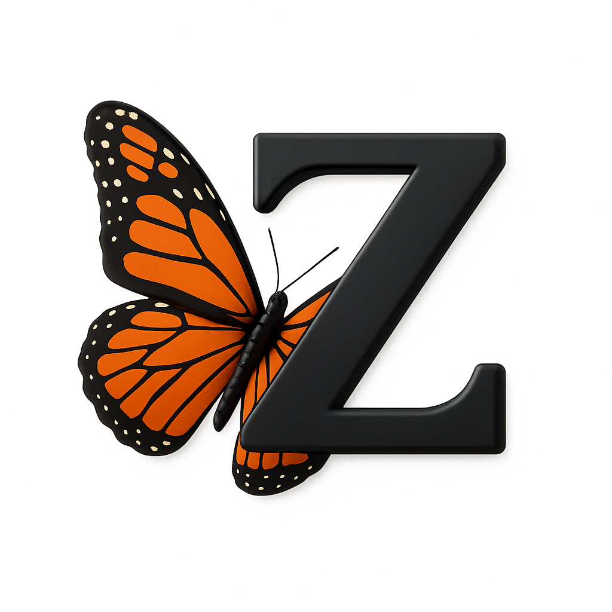

# ZOKATA

<p align="center">
  
</p>

ZOKATA is my personal Vulkan playground: a lean, ECS-inspired engine abstraction where I try out different graphics techniques to learn the whole stack. The code is meant to be read, tweaked, and broken in the name of experiments.

## What I am building
- ECS-style scaffolding to keep components, systems, and render passes tidy.
- A Vulkan renderer with explicit resource ownership and clear frame steps.
- ImGui-powered debugging and live tweak hooks.
- A place to bolt on many techniques over time: deferred or forward+, clustered lighting, compute-driven culling, PBR/IBL, GPU particles, ray tracing experiments, and assorted post-processing.

## Build & run

ZOKATA uses CMake (C++23) and vcpkg manifest mode for dependencies (Vulkan SDK, GLFW, GLM, ImGui).

1) Install prerequisites
   - CMake 3.24+ and a C++23 compiler (MSVC/Clang/GCC).
   - Vulkan SDK installed; ensure `VULKAN_SDK` and the SDK `bin` are on `PATH`.
   - vcpkg installed and `VCPKG_ROOT` pointing to your vcpkg checkout.
   - On Windows, the `Vulkan::Vulkan` and `glfw` targets are provided via vcpkg manifest mode; no manual package selection is needed.

2) Configure (first time pulls dependencies via vcpkg)
```sh
cmake -S . -B build
```
   - To pick a specific generator (e.g., Visual Studio), add `-G "Visual Studio 17 2022"`.
   - To set a single-config type (e.g., Debug), add `-DCMAKE_BUILD_TYPE=Debug`.

3) Build
```sh
cmake --build build --config RelWithDebInfo
```
   - For single-config generators omit `--config` and build the chosen type.
   - If dependencies were missing, the previous step triggers vcpkg to fetch and build them automatically.

4) Run the sandbox
   - Multi-config (Visual Studio): `build/RelWithDebInfo/ZOKATA.exe`
   - Single-config (Ninja/Makefiles): `build/ZOKATA` (append `.exe` on Windows)

5) Tweak and iterate
   - Use ImGui panels in the app to toggle systems/passes or adjust settings.
   - Add new scenes or assets under `scenes/` and reference them from the app setup.

## Project layout
- `include/` public headers
- `src/` engine sources (private headers live here as well)
- `scenes/` sample data and test scenes
- `vcpkg.json` manifest dependencies
- `CMakeLists.txt` build configuration

| Module            | Type        | Purpose                                              | Paths                                 |
| ----------------- | ----------- | ---------------------------------------------------- | ------------------------------------- |
| Zokata-math       | Static lib  | Math helpers and utilities (glm-backed)              | `include/ZokataMath`, `src/ZokataMath` |
| Zokata-log        | Static lib  | Lightweight logging and diagnostics                  | `include/ZokataLog`, `src/ZokataLog`   |
| Zokata-renderer   | Static lib  | Vulkan renderer, frame steps, render/compute passes  | `include/ZokataRenderer`, `src/ZokataRenderer` |
| Zokata-engine     | Static lib  | ECS-style runtime, scene systems, engine glue        | `include/ZokataEngine`, `src/ZokataEngine` |
| ZOKATA            | Executable  | Sandbox app that wires the engine and sample scenes  | `src/ZOKATA`                           |

If you want to tinker, drop a new technique behind a feature flag, hook it into the renderer interface, and expose knobs through ImGui. This is a personal sandbox, but ideas and improvements are welcome.
